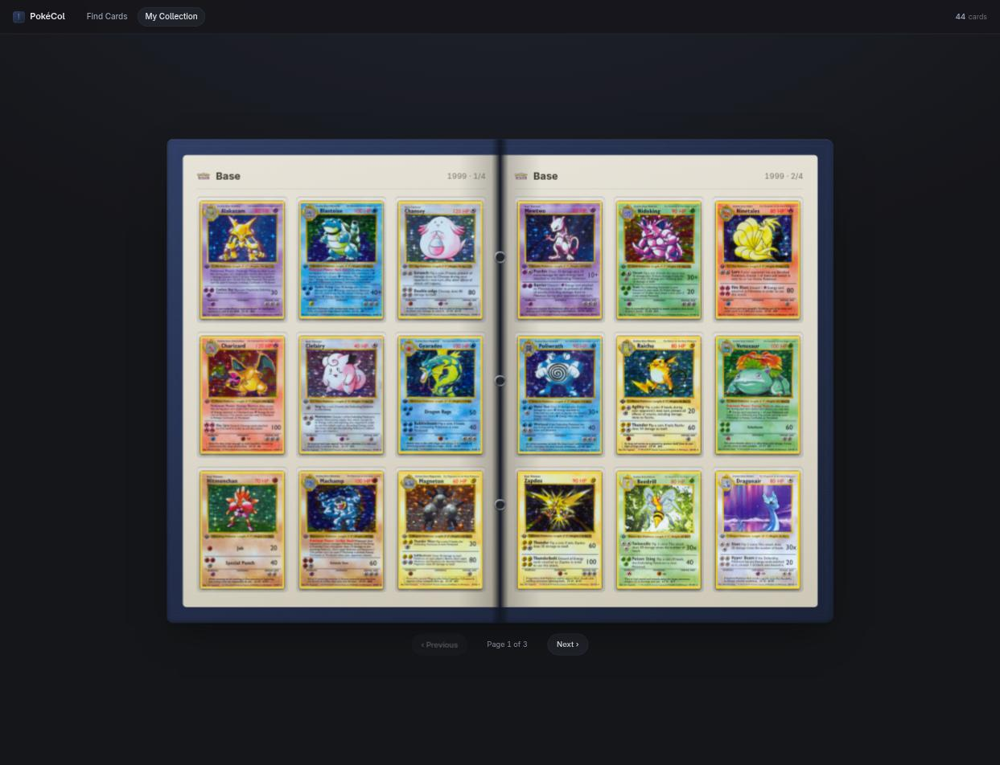
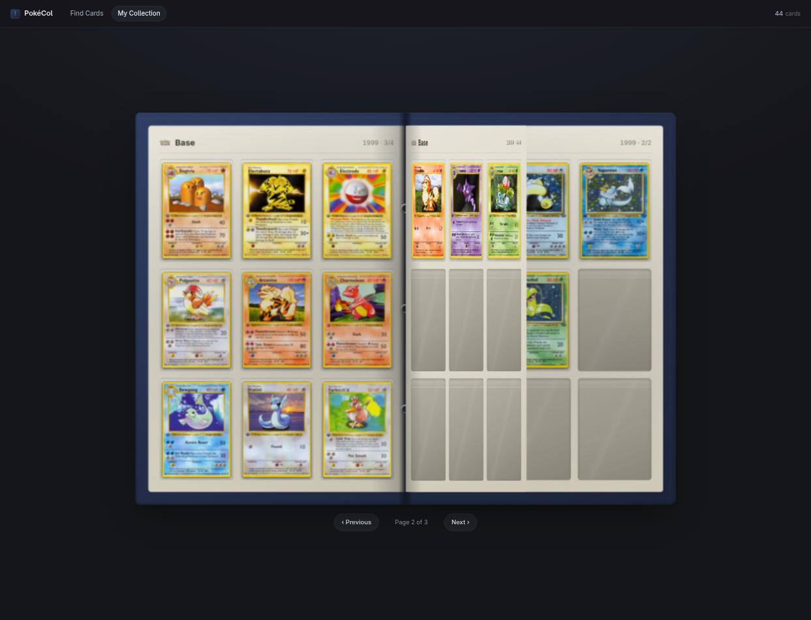
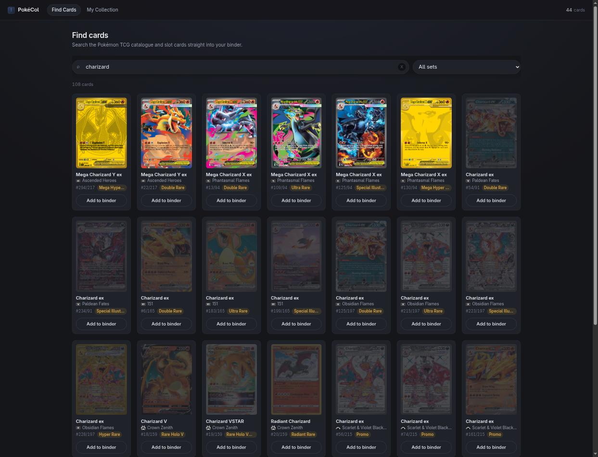
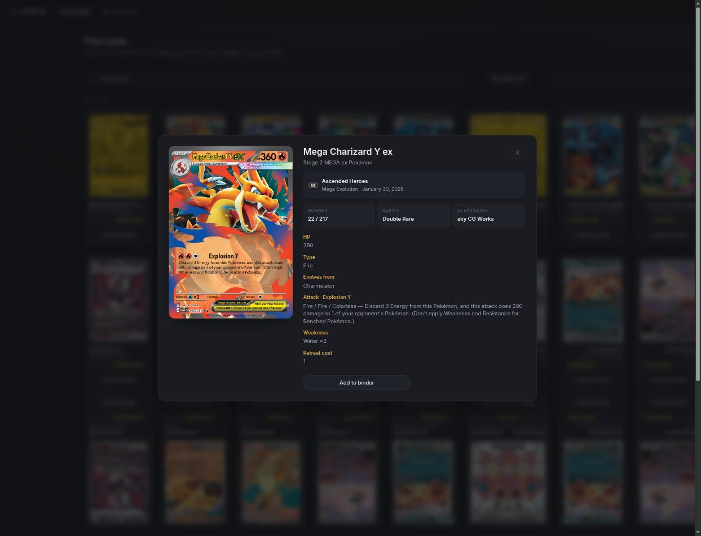

# CardCol

A trading card collection app where your cards live in a **physical binder** —
3×3 sleeve pages, a centre spine, and a real page-turn — instead of a
responsive grid.

Six games: **Pokémon**, **Magic: The Gathering**, **Yu-Gi-Oh!**,
**Star Wars: Unlimited**, **One Piece** and **Disney Lorcana**. Each keeps its
own collection, wishlist and arrangement — switching game switches universe.

Search a card → add it → open My Collection → it's sitting in a sleeve.



---

## What it does

### My Collection — the binder

Your collection is an actual binder. Nine sleeves a page, two facing pages, a
stitched cover and metal rings down the spine. Cards sit *inside* translucent
sleeves with a diagonal sheen and a shadow separating them from the page.

Turning a page is a real 3D turn hinged at the spine — the leaf rotates, the
cards stay attached to it, and the next page appears underneath.



Cards are laid out the way a collector would fill a binder:

- ordered by **set release date**, then card number (naturally, so `2 < 10 < TG01`)
- **every set starts on a fresh page** — a set never bleeds across a page break
- a part-finished set keeps its empty pockets, so a gap looks like a gap
- duplicates show a `×N` tag in the sleeve corner

Navigate with the page edges, the prev/next buttons, or the ← / → keys. Under
760px wide the binder shows one page at a time and the turn still works.

### Find Cards

Search the active game's catalogue by name and slot cards straight into the
binder.
Cards you own are marked and their button becomes a quantity stepper, so
ownership is obvious while you scan.



- name search, forgiving about partial words and multiple terms (`blaine char` works)
- filter by set, where the game has meaningful sets
- name, set, number, rarity and set symbol on every result
- infinite scroll, 24 cards a page — the catalogue is never loaded at once

### Card detail

Click any card — in the binder or in search — for the full-resolution artwork
and its details. Opening it from the binder doesn't lose your page.



The high-res image loads behind the small one blurred, so the panel is never
blank while ~845KB decodes.

### Wishlist

Cards you're hunting, as a clean grid rather than a binder — a wishlist is a
list you take to a trade, not an object you arrange. Each entry stores the
**printing** you actually want (normal vs foil vs 1st edition), shows what it's
currently worth, and "I got this" moves it straight into the collection as that
exact printing.

### Collection value

An estimated market value for what you own, priced per printing where the
provider supports it. Cards with no published price are excluded and counted —
"128 of 141 cards priced" — rather than quietly treated as worthless. It's an
estimate of current market prices, not an appraisal, and says so.

### Accounts

CardCol works signed out and always will — an account **adds sync, it doesn't
gate anything**. Signing in scopes your collections to an identity so two people
sharing a laptop don't share a binder.

Without a backend configured you get device-local profiles, and the login page
says plainly that they're device-local and not a security measure. Set
`VITE_SUPABASE_*` for real hosted accounts. See **[ACCOUNTS.md](ACCOUNTS.md)** —
including what's built and what's still missing (the sync layer itself).

### Install it on a phone

CardCol is an installable PWA. The binder already works under touch — drag a
card between sleeves, tap to inspect, swipe to turn the page — and once
installed the shell and every card image you've seen are cached, so a filled
binder opens with no signal.

### Also in there

- **undo the last move** — mis-drop a card and take it back with the toolbar
  button or Ctrl/Cmd+Z
- collection persists locally and syncs across browser tabs
- loading skeletons, retry-on-error, and a card-back fallback for missing art
- keyboard navigable; respects `prefers-reduced-motion`

---

## Running it

Requires **Node 20+** (developed on Node 25). No backend, no database.

```bash
git clone <this-repo>
cd cardcol
npm install
npm run dev
```

Open **http://localhost:5173**. It opens on an empty binder — go to **Find
Cards**, search something, and add it. Click **CardCol** in the top-left to
switch game.

### Scripts

| Command | What it does |
|---|---|
| `npm run dev` | dev server with hot reload on :5173 |
| `npm run build` | typecheck (`tsc -b`) then production build to `dist/` |
| `npm test` | run the test suite once |
| `npm run test:watch` | tests in watch mode |
| `npm run lint` | oxlint |
| `npm run preview` | serve the production build (needed to test the service worker) |

### API keys

Four of the six games need no key at all — Magic (Scryfall), Yu-Gi-Oh!
(YGOPRODeck) and Lorcana (Lorcast) are open, and Pokémon works anonymously.

```bash
cp .env.example .env.local
```

| Variable | Needed for | Without it |
|---|---|---|
| `VITE_POKEMONTCG_API_KEY` | Pokémon | Optional — anonymous is 1000/day, a key gives 20,000 |
| `VITE_APITCG_API_KEY` | Star Wars, One Piece | **Those two games show a "not set up yet" panel.** Free key at [apitcg.com/register](https://apitcg.com/register) |

Restart the dev server after adding one.

### Heads-up: the data sources have quirks

Each provider is documented in **[ARCHITECTURE.md](ARCHITECTURE.md)**, including
the limitations that are real and deliberate. The two worth knowing up front:

- **Yu-Gi-Oh! card images are hotlinked against YGOPRODeck's terms**, which ask
  callers to re-host. This works locally but **needs an image proxy before any
  public deployment**.
- **The Pokémon TCG API returns 500s and 502s under light bursts.** The client
  retries with backoff and serves cached data, so it's mostly invisible. One
  quirk while debugging: an API 5xx arrives in the browser as
  `TypeError: Failed to fetch`, **not** a status code — Cloudflare's error pages
  don't carry the CORS header, so the browser blocks the response before your
  code sees it.

### Filling the binder quickly

Adding thirty cards by hand to test paging is tedious, so dev builds expose:

```js
__pokecol.seed("base1", 30)              // first 30 Base Set cards
__pokecol.seed("blb", 12, "magic")       // 12 Bloomburrow cards into Magic
__pokecol.clear()                        // empty the Pokemon collection
__pokecol.clear("magic")                 // empty the Magic one
```

Run these in the browser console. They're stripped from production builds.

---

## What could be next

Rough order of value:

- [x] **Tests.** `npm test` covers the cache's single-flight and abort
      behaviour, `layoutStore` (swap, baseline freeze, undo, per-game
      partitioning), the binder layout functions, and every provider's
      normaliser against captured live responses. Still missing: the flip
      controller around cancellation, and the two pointer gestures around the
      tap/drag threshold.
- [ ] **Accounts and sync.** `CollectionStore` was built for this — implement
      the interface against an API and swap one export. See ARCHITECTURE.md.
- [ ] **Sort and group options.** Currently fixed to set-then-number. Recently
      added, by rarity, or by Pokédex number are all natural.
- [x] **Drag to reorder / place cards** in specific pockets, like a real binder.
- [x] **Set completion progress** — "84/102 collected" per set, and a way to see
      which numbers are missing.
- [x] **Drag or swipe to turn pages**, following the pointer rather than
      committing on click.
- [x] **A second TCG.** Six now, behind one `CardProvider` contract.
- [x] **Variants** — holo vs reverse holo vs 1st edition are different things to
      a collector but one `cardId` here.
- [ ] **Virtualise long binders.** Only the current spread renders, so it's fine
      today, but resolving a 500-card collection is 50 sequential-ish requests
      on first load.
- [ ] **Export and import the collection.** It lives only in this browser's
      `localStorage` — one cleared profile and it's gone. A JSON round-trip is
      small and buys a backup, plus a way to move between machines before
      accounts exist.
- [x] **Undo a move.** One level, in memory, on a toolbar button and Ctrl/Cmd+Z.
- [x] **Collection value.** Priced by the printing actually owned, with
      unpriced cards surfaced rather than counted as zero. Per-set totals are
      still to do.
- [x] **A wishlist.** Its own section, scoped per game, storing the printing
      you want. Marking gaps *wanted* straight from the full-set view is still
      to do.
- [ ] **A duplicates view.** Quantities are tracked (`×N`) but never surfaced as
      "here is everything you have spare" — the thing you'd actually take to a
      trade.
- [ ] **Name and reorder custom pages.** A custom arrangement has pages but no
      identity — no titles, and no way to move a whole page.
- [ ] **Offline.** Cards are already cached in IndexedDB; a service worker and a
      manifest would make an installed binder work on a phone with no signal.
- [ ] Deploy it — it's a static bundle, so any host works.

---

## Tech

Vite 8 · React 19 · TypeScript 6 · React Router 8 · CSS Modules · idb-keyval ·
Vitest. No UI kit, no animation library, no page-flip library — the binder is
hand-rolled CSS 3D driven by the Web Animations API.

See **[ARCHITECTURE.md](ARCHITECTURE.md)** for how it's all wired together.

## Notes

Card data and imagery come from [Pokémon TCG API](https://pokemontcg.io/),
[Scryfall](https://scryfall.com/), [YGOPRODeck](https://ygoprodeck.com/),
[Lorcast](https://lorcast.com/) and [apitcg.com](https://apitcg.com/).

All card artwork, names and logos are the property of their respective rights
holders — Nintendo / Creatures Inc. / GAME FREAK inc., Wizards of the Coast,
Konami, Fantasy Flight Games, Bandai and Disney. This is an unofficial fan
project, not affiliated with or endorsed by any of them. No artwork and no
trademarked logos or typefaces are stored in this repository: the per-game
branding in the header is plain text styled with system fonts, and card images
are loaded from each provider's CDN at runtime (screenshots above excepted).

**Before deploying publicly**, see the Yu-Gi-Oh! image-hosting limitation in
[ARCHITECTURE.md](ARCHITECTURE.md) — YGOPRODeck asks callers to re-host rather
than hotlink, and CardCol currently hotlinks.
